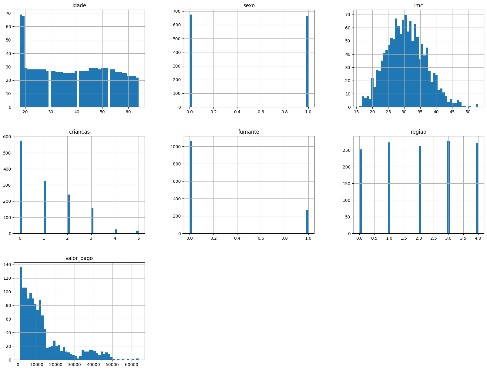
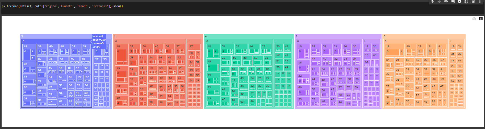
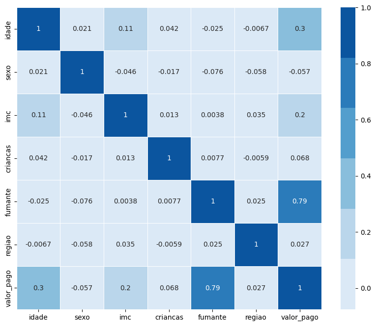
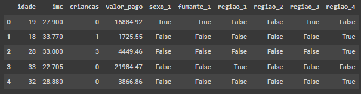
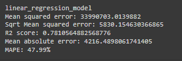
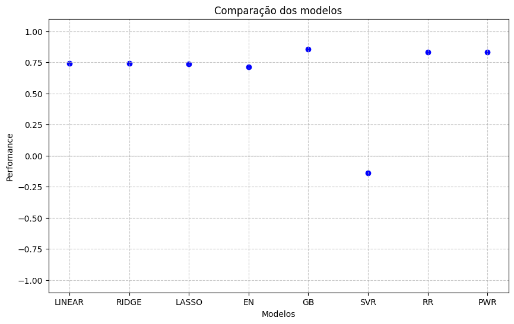
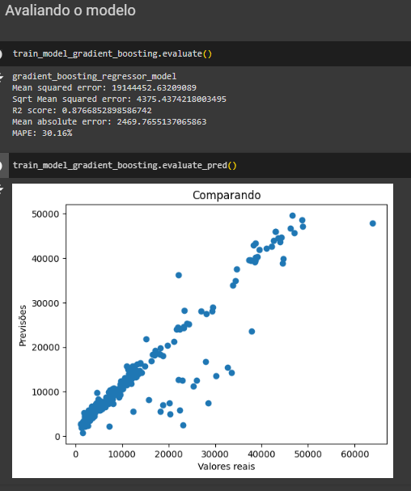
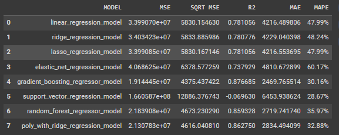

# Introdução
Projeto destinado ao **Desafio da Fase 1*** do curso de pós graduação "AI para devs" na FIAP.

## Quer ver no Google Colab?
[](https://colab.research.google.com/drive/1FMgEsQIjyI9aRKMShcE2MrBIQeLsXKFi?usp=sharing)

## Integrantes
- [Abimael Silva](https://github.com/abimael-boby)
- [Anne Izaura](https://github.com/anneizaura)
- [Deyvid Jaguaribe](https://github.com/DeyvidJLira)
- [Lucas Cervantes](https://github.com/Cervas23)
- [Thiago Bussiki](https://github.com/ThiagoBussiki)

## Contexto
Você é um profissional encarregado de desenvolver um **modelo preditivo de regressão** para prever o valor dos custos médicos individuais cobrados pelo seguro de saúde. A base de dados para este desafio pode ser algo como no exemplo a seguir:

| idade | gênero | imc | filhos | fumante | região | encargos |
|---|---|---|---|---|---|---|
| 56 | feminino | 29.774373714007336 | 2 | sim | sudoeste | 31109.889763423336
| 46 | masculino | 25.857394655216346 | 1 | não | nordeste | 26650.702646642694
| 32 | masculino | 23.014839993647488 | 0 | não | sudoeste | 21459.03799039332


## Objetivo
Desenvolver um algoritmo capaz de prever o custo do seguro de saúde com o uso de machine-learning.

## Estratégia de desenvolvimento
Cada integrante da equipe se comprometeu seguir um estudo inicial particular com o objetivo de, a partir do dia 15/07/2024, realizarmos um debate conjunto e definirmos a melhor abordagem para construir uma versão final. Os estudos eram a construção de uma solução via Github ou Colab para termos diferentes perspectivas.

Para a implementação do projeto, entendemos que em modelos de regressão linear seria interessante o uso de uma base de dados significativa. Com isso criamos o arquivo raw.csv (saiba mais no tópico **Como está organizado**),  baseado no insurance.csv (ver em https://github.com/FIAP/CURSO_IA_ML/blob/main/insurance.csv), que foi adaptado para o contexto do Brasil incluindo as regiões brasileiras, traduzindo e ajustando os valores.

## Estudos iniciais
- [Estudo por Abimael](https://github.com/DeyvidJLira/fiap-aidev-team-project-fase1/tree/abimael)
- [Estudo por Anne](https://github.com/DeyvidJLira/fiap-aidev-team-project-fase1/tree/anne)
- [Estudo por Deyvid](https://github.com/DeyvidJLira/fiap-iadev-project-fase1)
- Estudos por Lucas:
  - [Estudo 1](https://colab.research.google.com/drive/1lGsgvNWvoc5h4TruXKfTWEzljGHvqHQ9?usp=sharing)
  - [Estudo 2](https://colab.research.google.com/drive/1-Cxv62olOdSXTzT_WWAqQRcN_zlWfzX0?usp=sharing)
- [Estudo por Thiago](https://colab.research.google.com/drive/1OctIvG-iLKdAPtq6CMEN-HrUoKMD78jA?usp=sharing)

## Como está organizado
O projeto é formado pelas seguintes pastas e arquivos, com os respectivos propósitos:
- data -> destinado a conter arquivos de dados, no caso em csv;
  - raw.csv -> arquivo de dados base;
  - main.ipynb -> destinado a conter código fonte do projeto dividido por seções.


## Rodando a aplicação (form)
- Basta executar todos os scripts contidos em *Passo 0: Setup*;
- Executar a função ```build_and_start_app()```.


# Relatório de Resultados

## Análise Exploratória dos Dados
Após analisar os dados contidos em **raw.csv**, seguindo uma estratégia de exploração que visava:
- checar os tipos de dados;
- quantidade de registros:
- verificar presença de dados faltantes;
- identificação de colunas candidatas a serem categóricas.

## Pré Tratamento de Dados
Identificamos quais colunas seriam categorias, no caso respectivamente: sexo, fumante e região. Fizemos então, um mapeamento desses dados visando gerar uma versão processada do csv. 

## Análise Exploratória dos Dados - fase 2
Com isto partimos para uma análise mais profunda onde:

> Verificamos como estavam distribuídos:



> Geramos um mapa dinâmico seguindo a ordem: região > fumante > idade > crianças:



> Analisamos a correlação entre os dados:



Em posse do entendimento gerado por essas análises iniciamos a construção do modelo.

## Criação dos Modelos
Nesta fase preparamos os dados categóricos para serem processados no treinamento e separamos as variáveis independentes da dependente (target).



Checamos a proporção da relação de fumantes para base de treino e teste (uma vez que é o item que tinha alta correlação com a target). 

Por fim, uma etapa crucial em qualquer projeto de machine learning é a preparação dos dados, que inclui a *separação* dos mesmos em dois conjuntos distintos: um para treinamento e outro para teste. O conjunto de treinamento é utilizado para ajustar o algoritmo enquanto o conjunto de teste é reservado para avaliar o desempenho do modelo ao final do processo, permitindo analisar acertos e erros.

Nesta abordagem, os dados serão divididos na proporção de 80% para treinamento e 20% para teste. Além disso, o índice dos conjuntos será redefinido para evitar qualquer possibilidade de identificação ou relação entre os dados e será verificado o tamanho final dos conjuntos.

O primeiro modelo que testamos foi o *Linear Regression* e obtivemos os seguintes resultados:


Então tentamos melhorar o resultado removendo as categorias que tinham baixa correlação. No entanto, o que foi percebido é que a ausência deles não impactou consideravelmente o resultado do modelo.

Além disso, decidimos explorar outros modelos, tais como o SupportVectorRegression, RandomForestRegressor, GradientBoostingRegressor e o PolyWithRidgeRegression.

Dito isto, reescrevemos o código para ficar mais organizado (com isso criamos o Passo 0: Setup que centraliza alguns recursos que serão reutilizados no projeto como todo).

## Comparação de modelos

Com o código organizado e com os modelos mapeados, devido a quantidade que queríamos testar resolvemos criar uma estrutura que agrupasse funções comuns para os modelos e assim, utilizarmos como base para redução de código (foi criado a classe ```TrainModelBase```).

Testamos os seguintes modelos:
- Linear Regression;
- Ridge Regression;
- Lasso Regression;
- Elastic Net Regression;
- Gradient Boosting Regressor;
- SVR;
- Random Forest Regressor;
- Poly com Ridgel.

Para compará-los, utilizamos a função ```cross_val_score``` junto com o KFold para fazer esse cruzamento de resultados. E usamos **max** no dicionário que geramos para obter o modelo com mais precisão. 

Para facilitar a execução de novos dados para o modelo, foi criado uma aplicação com interface que carrega os modelos salvos e, com o input do usuário no formulário, exibimos a predição baseada no modelo selecionado.

## Conclusão

Após o processamento dos modelos fica evidente que o modelo **GradientBoostingRegressor** foi o melhor. Observando o gráfico abaixo, pode se ver que concluir que no quesito acurácia ele apresenta o melhor valor: 0,855. 



Alguns dados a mais sobre o modelo:



Além disso, é possível comparar também os resultados pelas outras métricas. Obtendo como uma confirmação que o modelo selecionado também apresenta as melhores métricas entre os modelos testados:




